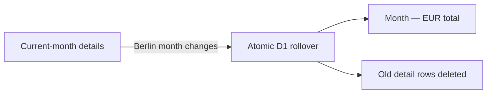

<div align="center">
  

  # Ausgeben

  **A private, phone-first shared expense tracker for Passau, Germany.**

  <p>
    
    
    
    
  </p>
</div>

<p align="center">
  
</p>

Ausgeben gives **Aayushman** and **Carlin** one shared ledger that stays in
sync across signed-in devices. It keeps the active month detailed and turns
each closed month into one compact total.

## What it does

- Records a description, euro amount, and date in a phone-friendly form.
- Shows the shared total for today and the current month.
- Attributes each entry to its creator; only that person can edit or delete it.
- Refreshes when the app regains focus so changes from another device appear.
- Stores authoritative data in Cloudflare D1 instead of browser storage.
- Formats money with `de-DE` rules and keeps amounts as integer cents.

Only the two fixed account names above are accepted. Passwords are never stored
in this repository or documented here.

## Monthly lifecycle

The server determines the date in `Europe/Berlin`. New and edited entries must
belong to the current Berlin month and cannot be dated in the future. Once a
month closes, its details can no longer be added to or changed.

On the first ledger read or mutation in a new month, one atomic D1 batch:

1. advances the canonical month without allowing it to move backwards;
2. adds every older month's amount and entry count to its summary; and
3. deletes the corresponding detailed expense rows.

The archive then exposes one non-editable row such as **July — 423,18 €**.
The additive upsert and deletion happen in the same transaction, so retries and
concurrent requests cannot double-count a month.



## Authentication and security

- Passwords are checked against per-account PBKDF2-SHA-256 verifiers with
  unique salts and the Worker runtime maximum of 100,000 iterations.
- Unknown account names use a dummy verifier to reduce timing differences.
- Successful login creates a 14-day HMAC-SHA-256 signed session in an
  `HttpOnly`, `SameSite=Strict` cookie; HTTPS adds `Secure` and the `__Host-`
  prefix.
- Five failed logins trigger a 15-minute, IP-scoped rate limit. The stored key
  is HMAC-derived rather than a raw IP address.
- State-changing API calls require same-origin JSON, Fetch Metadata checks, and
  an application request header. API responses are marked `no-store`.
- Authorization is enforced in the Worker: both accounts can read the ledger,
  while only an expense's creator can modify it.

## Technology

| Layer | Choice |
|---|---|
| Interface | Next.js 16, React 19, TypeScript 5.9 |
| Styling | Tailwind CSS 4 foundation with responsive custom CSS |
| Runtime | vinext, Vite 8, Cloudflare Workers |
| Persistence | Cloudflare D1 with raw prepared statements and atomic batches |
| Schema | Drizzle schema definitions and generated SQL migrations |
| Authentication | Web Crypto PBKDF2 and HMAC-signed cookies |

Drizzle is used to define and generate the schema. Application queries use the
raw D1 binding so transaction boundaries remain explicit.

## Local setup

Requirements: Node.js `22.13.0` or newer and npm.

```bash
npm install
cp .env.example .env.local
npm run dev
```

Before starting, replace every placeholder in `.env.local`:

- `SESSION_SIGNING_KEY` must contain at least 32 random bytes;
- each `PASSWORD_VERIFIER_*` value must use the format shown in
  `.env.example`, with a unique salt and PBKDF2-derived digest; and
- `PASSWORD_VERIFIER_DUMMY` should be a separate valid verifier.

Real secrets belong only in ignored local environment files and the hosted
Sites runtime configuration. Never commit them. The Cloudflare Vite plugin
provides a persistent local D1 binding during development.

## Database migrations

The source of truth is [`db/schema.ts`](./db/schema.ts). After changing it,
generate and inspect a migration:

```bash
npm run db:generate
```

Commit the resulting files under `drizzle/`. The build packages those files
with the Sites deployment, while the runtime also performs idempotent schema
initialization for a fresh local database.

## API

| Method | Endpoint | Purpose |
|---|---|---|
| `POST` | `/api/auth/login` | Verify one of the two accounts and set a session cookie |
| `GET` | `/api/auth/session` | Return the signed-in account |
| `POST` | `/api/auth/logout` | Expire the session cookie |
| `GET` | `/api/ledger` | Return current details, totals, and monthly summaries |
| `POST` | `/api/expenses` | Add a current-month expense |
| `PATCH` | `/api/expenses/:id` | Update an expense created by the signed-in account |
| `DELETE` | `/api/expenses/:id` | Delete an expense created by the signed-in account |

All ledger routes require a valid session. Errors use a stable JSON code and a
human-readable message.

## Scripts

| Command | Purpose |
|---|---|
| `npm run dev` | Start the vinext development server and local D1 runtime |
| `npm run build` | Build the Cloudflare Worker application |
| `npm run start` | Run the production build locally |
| `npm run lint` | Check the source with ESLint |
| `npm test` | Build and run rendered-output and architecture tests |
| `npm run db:generate` | Generate SQL migrations from the Drizzle schema |

## Project structure

```text
Ausgeben/
├── app/                              # App Router page, metadata, and styles
├── components/expense-tracker/
│   ├── ExpenseTracker.tsx            # Authenticated feature orchestration
│   ├── LoginScreen.tsx               # Two-account sign-in screen
│   ├── ExpenseForm.tsx               # Add/edit bottom sheet
│   ├── ExpenseList.tsx               # Current-month detailed entries
│   ├── SpendingSummary.tsx           # Today and current-month totals
│   └── MonthlyArchive.tsx            # One total per closed month
├── hooks/use-shared-ledger.ts         # Session, API, refresh, and mutation state
├── lib/                               # Validation, sorting, and EUR/date formatting
├── types/expense.ts                   # Client domain and API types
├── worker/
│   ├── index.ts                       # Worker and vinext request entry point
│   ├── api.ts                         # JSON routes and request protections
│   ├── auth.ts                        # PBKDF2, sessions, and login throttling
│   ├── database.ts                    # D1 queries and monthly rollover
│   └── types.ts                       # Cloudflare binding contracts
├── db/schema.ts                       # Drizzle D1 schema
├── drizzle/                           # Generated, versioned SQL migrations
├── docs/media/ausgeben-demo.svg       # Animated README preview
├── public/                            # App icon and social preview
├── tests/                             # Production-render and architecture tests
├── .env.example                       # Non-secret configuration template
└── .openai/hosting.json               # Sites D1 binding declaration
```

## Privacy and limitations

- Expense descriptions, amounts, dates, creator IDs, monthly summaries, and
  rate-limit counters are stored in the configured Cloudflare D1 database.
- Both accounts can see every current-month entry and every archived total.
- Closed-month details are deleted from the active database and are not
  available through the application; the summary total and count remain.
- There is no per-user ledger, category system, budget, export, receipt upload,
  offline write queue, or conflict-resolution interface.
- A network connection is required to read or change the ledger.
- Anyone with an account's credentials can access the shared data, so hosted
  secrets and devices with active sessions must be protected.
