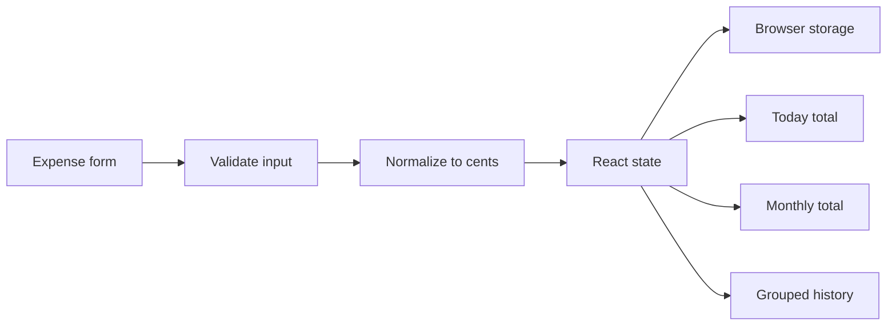

<div align="center">
  

  # Ausgeben

  **A private, phone-first expense tracker for everyday life in Passau, Germany.**

  <p>
    
    
    
    
  </p>
</div>

<p align="center">
  
</p>

> [!NOTE]
> Ausgeben is currently a single-user, single-device application. It has no
> account system, analytics, cloud synchronization, or database.

## What it does

Ausgeben keeps expense tracking intentionally small and quick:

- record what you spent on, the euro amount, and the date;
- see today’s total and the selected month’s total at a glance;
- browse older months with entries grouped by day;
- edit an entry or delete it when something was entered incorrectly;
- keep everything in the current browser without creating an account;
- work comfortably from a phone, including iPhone safe areas and large touch targets.

Amounts accept both German comma decimals (`12,50`) and dot decimals (`12.50`).
Every displayed value uses the `de-DE` locale and EUR currency formatting.

## Local data and privacy

Expenses are stored under the versioned browser key
`ausgeben:expenses:v1`. The application validates stored records before using
them and keeps money as integer cents to avoid floating-point rounding errors.

No expense data is sent to the server. This choice also has important limits:

- another browser or device will not have the same entries;
- localhost and the deployed website have separate browser storage;
- private browsing may discard entries when the session ends;
- clearing the site’s browser data permanently removes its expenses;
- there is no automatic backup or cross-device synchronization yet.

## Technology

| Layer | Choice | Why |
|---|---|---|
| UI | Next.js 16 + React 19 | Modern server-rendered shell with a focused client boundary |
| Language | TypeScript 5.9 | Strict types for expense records and storage validation |
| Styling | Tailwind CSS 4 foundation + custom CSS | Responsive design tokens, motion, and precise mobile behavior |
| Build | vinext + Vite 8 | Cloudflare Worker-compatible Next.js output |
| Persistence | Browser `localStorage` | Matches the initial single-user, no-database requirement |
| Formatting | Native `Intl` APIs | German euro and date formatting without extra dependencies |

The project deliberately avoids a state library, chart library, icon package,
and backend service. The first release does not need them.

## Getting started

### Requirements

- Node.js `22.13.0` or newer
- npm

### Run locally

```bash
npm install
npm run dev
```

Open the local address printed by the development server.

### Verify a change

```bash
npm run lint
npm test
```

`npm test` creates the production build before checking the rendered
application shell and its local-only storage boundaries.

## Scripts

| Command | Purpose |
|---|---|
| `npm run dev` | Start vinext development mode with hot reloading |
| `npm run build` | Create the production Cloudflare Worker build |
| `npm run start` | Run the built application locally |
| `npm run lint` | Check React, TypeScript, and project source with ESLint |
| `npm test` | Build and run rendered-output and architecture tests |

## Architecture

The server renders the application shell. All expense entry, calculations, and
persistence stay inside one client-side feature boundary.



The saved record is deliberately small:

```ts
type Expense = {
  id: string;
  description: string;
  amountCents: number;
  date: string;      // YYYY-MM-DD
  createdAt: string; // ISO timestamp
};
```

### Project structure

```text
Ausgeben/
├── app/
│   ├── globals.css                 # Theme, responsive layout, and motion
│   ├── layout.tsx                  # Metadata, fonts, icon, and viewport
│   └── page.tsx                    # Server-rendered application route
├── components/
│   └── expense-tracker/
│       ├── ExpenseForm.tsx         # Add/edit bottom sheet
│       ├── ExpenseList.tsx         # Dated, grouped history
│       ├── ExpenseTracker.tsx      # Feature orchestration
│       └── SpendingSummary.tsx     # Today and monthly totals
├── hooks/
│   └── use-local-expenses.ts       # Hydration-safe browser persistence
├── lib/
│   ├── expenses.ts                 # Validation, math, grouping, and storage
│   └── formatters.ts               # EUR and human-readable dates
├── types/
│   └── expense.ts                  # Expense domain types
├── docs/media/
│   └── ausgeben-demo.svg           # Animated README preview
├── public/
│   ├── icon.png                    # Application icon
│   └── og.png                      # Social sharing card
├── tests/
│   └── rendered-html.test.mjs      # Production-render and boundary tests
├── worker/index.ts                 # Cloudflare Worker entry point
├── .openai/hosting.json            # Sites configuration; D1/R2 disabled
├── vite.config.ts                  # vinext and Sites build pipeline
└── package.json
```

## Product decisions

- **Phone first:** the main action stays above the device safe area, inputs use
  16px or larger text, and every important target is at least 44px.
- **Fast entry:** amount receives focus first, followed by description and date.
- **German context:** EUR values use German separators while the interface copy
  remains approachable in English.
- **Correctable history:** tapping an entry opens the same sheet for editing or
  deletion.
- **Restrained motion:** entry, sheet, and feedback animations respect
  `prefers-reduced-motion`.
- **Small scope:** categories, budgets, recurring transactions, accounts, and
  exports are intentionally not part of version 1.

## Accessibility

The interface includes semantic regions and headings, associated form labels,
inline error descriptions, polite save/delete announcements, keyboard escape
handling, visible focus rings, high-contrast text, tabular currency figures,
and reduced-motion fallbacks.

## Deployment

The production output is created through vinext and Vite for the included
Cloudflare Worker runtime:

```bash
npm run build
```

The current hosting declaration keeps both D1 and R2 set to `null`. Expense
data therefore remains in each visitor’s browser even when the application is
deployed.

## Current limitations

- Data remains in one browser on one device.
- There is no automatic backup, import, or export.
- Clearing browser site data deletes the history.
- The initial release is EUR-focused and uses the Europe/Berlin date context.

## Roadmap

The most useful additions, if the simple workflow proves itself, are:

1. JSON or CSV backup and restore.
2. Lightweight categories and filters.
3. Monthly budgets.
4. Installable offline/PWA behavior.
5. Optional synchronization that preserves a local-first default.
